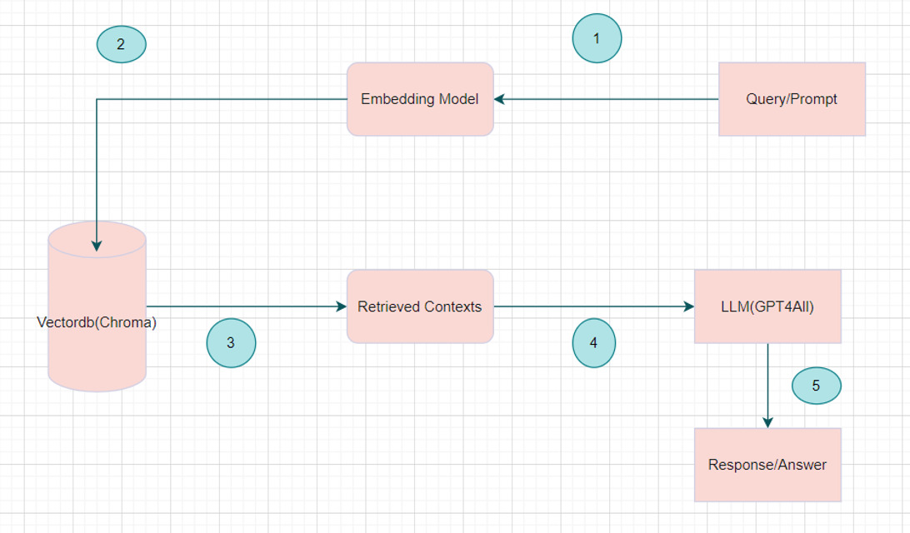
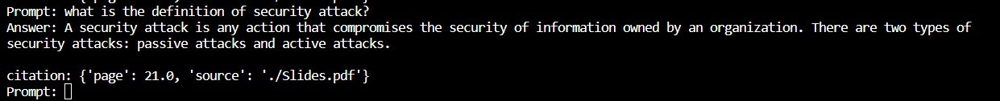
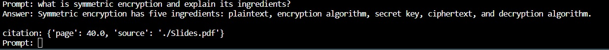

# OnDemand Teacher Q&A Bot
## Project Description
The objective of the project is to develop a locally hosted Q&A bot focused on network security, with an emphasis on data privacy and security by keeping information within the confines of the local system. This approach mitigates the risks associated with transmitting sensitive data over the internet, ensuring a more secure handling of information related to network security.The Q&A Bot is designed to understand and respond to user queries by drawing upon a comprehensive local database constructed from diverse sources, including network security lecture slides, a network security textbook, and relevant internet resources. To ensure the confidentiality of user data, all interactions and information processing occur exclusively within the confines of the local system. The bot's proficiency is cultivated through a robust training regimen that incorporates the amalgamation of knowledge derived from authoritative texts and real-world applications available on the internet.

## Required Environments
1. Visual Studio Code : Visual Studio Code is a versatile and feature-rich code editor that caters to a broad spectrum of developers and programming languages. Its combination of a user-friendly interface,powerful features, and extensibility has contributed to its widespread adoption in the developer community.
2. Python 3.11 : To benefit from Python 3.11's enhancements, including a notable 25% speed improvement in the standard benchmark suite compared to 3.10, as well as better error messages, exception notes, and a new typing feature, consider installing Python 3.11.
3. Wireshark : Wireshark is a popular open-source network protocol analyzer. It is widely used for network troubleshooting, analysis, software and protocol development, and education. Wireshark allows users to capture and analyze the data traveling back and forth on a network in real-time.
4. Npcap : It is a new library designed to replace WinPcap. Npcap is Nmap's packet capture library for Windows, and it offers improvements and additional features compared to WinPcap.
During the Wireshark installation process on Windows, you will likely see a box or prompt asking if you want to install the packet capture library (either WinPcap or Npcap).

## Adopted Libraries
1. sys: This is a module that provides access to some variables used or maintained by the Python interpreter, as well as functions that interact with the interpreter.

2. chroma: This library allows you to index and search for vectors efficiently. It appears to be used for creating a vector database for storing and retrieving vectorized representations of text.

3. langchain.llms.Replicate: This module seems to be a part of the "langchain" library and includes the Replicate class, which is likely responsible for handling the Replicate Llama2 Model for conversational AI.

4. langchain.vectorstores.Pinecone: This module includes the Pinecone class, which is used for setting up and interacting with the Pinecone vector database.

5. langchain.text_splitter.RecurssiveCharacterTextSplitter: This module includes the RecurssiveCharacterTextSplitter class, which is used for splitting documents into smaller chunks for processing.

6 .langchain.document_loaders.PyPDFDirectoryLoader: This module includes the PyPDFDirectoryLoader class, which is used for loading and preprocessing PDF documents.

7. langchain.embeddings.HuggingFaceEmbeddings: This module includes the HuggingFaceEmbeddings class, which is used for transforming text into numerical vectors using pre-trained embeddings from Hugging Face's Transformers library.

8. langchain.chains.ConversationalRetrievalChain: This module includes the ConversationalRetrievalChain class, which is used for setting up a chain that combines the Replicate model and Pinecone vector database for conversational retrieval.

## System Architecture

## Flow Of Execution
1. Loading and Preprocessing PDF Document
Explain how the PDF document is loaded, the use of the PyPDFLoader for extraction, and the subsequent splitting of the text into smaller chunks using CharacterTextSplitter.

2. Text Vectorization
Describe the process of transforming text into numerical vectors using HuggingFaceEmbeddings.

3. Setting up Pinecone Vector Database
Detail the steps involved in setting up the Pinecone vector database, including creating an index and populating it with vectorized texts.

4. Initializing Replicate GPT4all Model
Explain how the Replicate GPT4all Model is initialized, including the specific model version and input parameters.

5. Setting up Conversational Retrieval Chain
Describe the configuration of the Conversational Retrieval Chain, combining the Replicate model with the Pinecone vector database for interactive retrieval.

6. User Interaction Loop
Explain how the program enters a loop for user interaction, accepting queries, processing them through the Conversational Retrieval Chain, and providing responses. Clarify the mechanism for exiting the loop.
## Commands to Run the Code
1. Navigate to the Project Directory:cd path-of-project
2. Install Dependencies:pip install -r requirements.txt
3. Run the Python Script: python app.py 

## Issues Faced & Solutions
1. Missing Dependencies:Project has external dependencies, not having them installed can lead to errors.
Solution-Run pip install -r requirements.txt 

2. Environment Configuration:Our project relies on a specific Python version did not have the correct setup.
Solution- Used the correct Python Version 3.11

3. Path Issues: The terminal may not be in the correct directory, leading to file not found or import errors.
Solution - Navigate to the correct directory using the cd command

4. Incorrect API Tokens or Keys :  Used incorrect  API tokens which lead to authentication errors.
Solution - Used Valid Tokens which prevent it from authentication errors.

## Outputs

## Conclusion

This project successfully addressed the need for a secure and locally run Q&A Bot tailored to the network security course. By leveraging open-source alternatives to ChatGPT, a robust chatbot framework was selected and trained using a comprehensive dataset, including network security lecture slides, textbooks, and relevant internet information. The primary focus throughout the development was on maintaining data privacy, ensuring that all interactions occurred locally on the user's machine. The incorporation of citations in the bot's responses, whether from the local database or the internet, enhances transparency and credibility. This ensures that users not only receive accurate and contextually relevant information but also have access to the sources, fostering a deeper understanding of network security concepts. The project's success is underpinned by a commitment to data privacy, thorough training data, and a seamless integration of local and online resources, culminating in a valuable educational tool for the network security course. Ongoing updates and maintenance will be critical to keeping the bot's knowledge base current and reliable for users.

## Suggestions

This project could involve continuous improvement of the Q&A Bot's performance by incorporating machine learning techniques for better natural language understanding and refining its responses based on user feedback. Additio–nally, expanding the local database with updated information from new network security sources and regularly training the bot with the latest knowledge will enhance its accuracy and relevance over time

## FeedBack
Bot exhibits excellent performance through its thoughtful design, efficient vectorization, and seamless integration of components. 
## References
1. Replicate. (n.d.). Retrieved from https://replicate.ai/
2. Pinecone. (n.d.). Retrieved from https://www.pinecone.io/
3. Hugging Face Transformers. (n.d.). Retrieved from https://huggingface.co/transformers/
4. Python Software Foundation. (n.d.). Python. Retrieved from https://www.python.org/
5. Wireshark. (n.d.). Retrieved from https://www.wireshark.org/
6. Build a Chatbot Based on Your Own Documents with ChatGPT | Step-by-Step Guide – Vasos
Koupparis (vasos-koupparis.com)
7. https://github.com/openai/gpt-2
8. GitHub - Chainlit/chainlit: Build Python LLM apps in minutes⚡
9. GitHub - Prographers/Slack-GPT: A Slack Bot implementation for integration with
OpenAI ChatGPT. Supports GPT4 by default!
10. GitHub - VolkanSah/GPT-API-Integration-in-HTML-CSS-with-JS-PHP: A basic GPT
conversation script designed to help you learn to interact with OpenAI's GPT
technology. Includes best practices and a free security whitepaper.

Execution-Video: https://drive.google.com/file/d/18cTRf8W3te6mIrxQd154lqBr1-Peg6tf/view

https://github.com/maturimonika/-OnDemand-Professor-Q-A-Bot-/assets/58589073/5307b70d-5f08-4413-9bf0-9eab7dccad17

